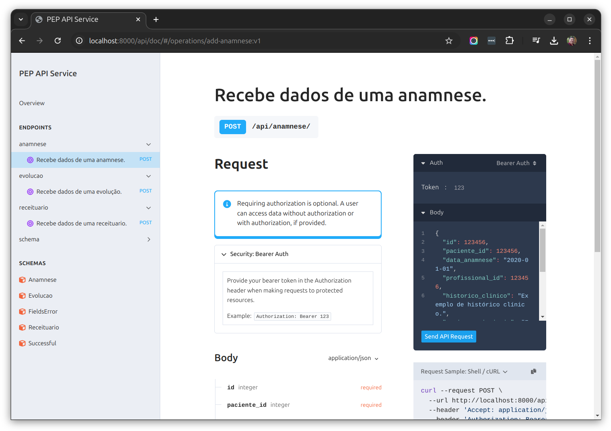
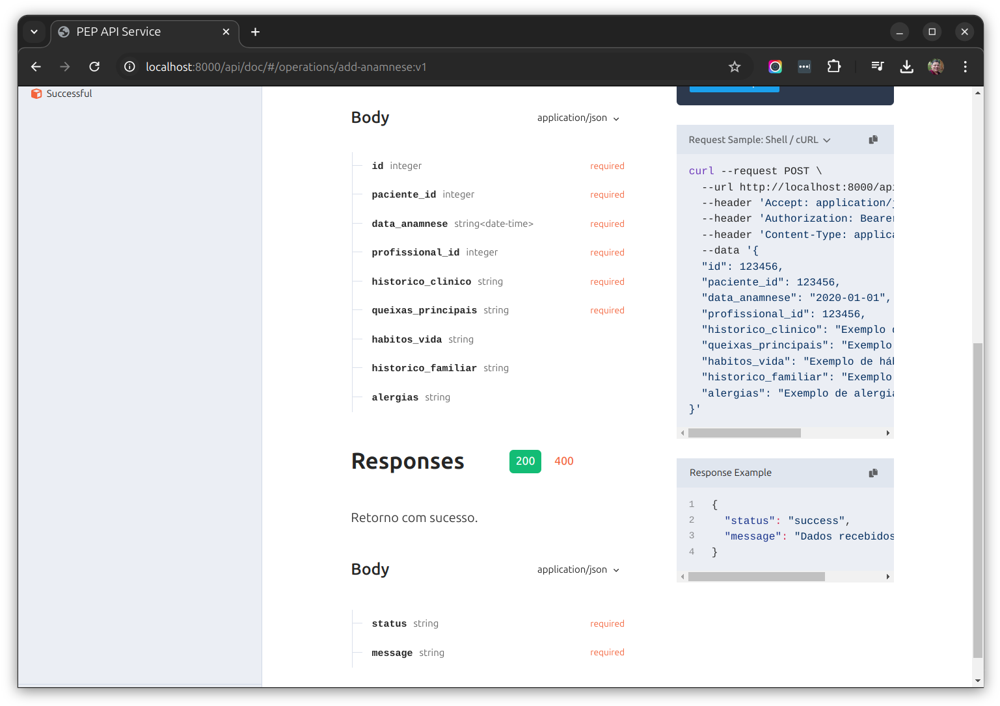

# Integração com serviço de PEP - Teste técnico

Este projeto tem como objetivo aplicar conhecimentos de Python, API, Docker, SQL, interoperabilidade de sistemas e boas práticas de desenvolvimento, como testes unitários e documentação.

A descrição detalhada dos requisitos para a realização do teste técnico estão no documento [docs/README_desafio.md](docs/README_desafio.md).

Este documento apresenta uma solução para o teste proposto na [tarefa 1](docs/README_desafio.md#1-integração-com-serviço-de-pep---prontuário-eletrônico-do-paciente-api-restful), enquanto o documento [docs/PEP_via_db.md](docs/PEP_via_db.md) apresenta uma solução para o teste proposto na [tarefa 2](docs/README_desafio.md#2-integração-com-pep-via-banco-de-dados).

## 🚀 Começando

As instruções contidas neste documento permitirão que você obtenha uma cópia do projeto em operação na sua máquina local para fins de desenvolvimento e teste.

Consulte **[Implantação](#-implanta%C3%A7%C3%A3o)** para saber como implantar o projeto localmente.

### 📋 Pré-requisitos

Nesta seção será descrita a lista de ferramentas necessárias para configurar e/ou executar o projeto na máquina.


#### - Requisitos para executar em container Docker

Se você deseja apenas executar essa API na máquina, como um container docker, será necessário a seguinte versão da ferramenta:

```
Docker (versão 27.2.1)
```


#### - Requisitos para executar na própria máquina

Se você deseja executar essa API na máquina localmente, será necessário as seguintes versões das ferramentas:

```
Docker (versão 27.2.1)
Python (versão 3.12)
Poetry (versão 1.8.3)
```

Se sua versão Python não for a requerida acima, você precisará das ferramentas:

```
curl
pyenv  (versão 2.4.12)
```


### 🔧 Instalação

Para baixar e preparar o projeto na máquina local, basta utilizar os seguintes comandos:

```bash
git clone https://github.com/boni254/pep-api-service
cd pep-api-service
make copy/local/envs
```

Caso queira executar a aplicação no container Docker, use o seguinte comando:

```bash
make deploy/local
```

Se você quiser preparar a aplicação para alteração de código na própria máquina, utilize o comando:

```bash
make install
```

Para executar a aplicação na própria máquina, utilize o comando:

```bash
make run
```

Após executada a aplicação, é possível acessar a área de administração do RabbitMQ pelo endereço http://localhost:15672/, com usuário `guest` e senha `guest`, e acessar a documentação da API pelo endereço http://localhost:8000/api/doc/.

Os endpoints podem ser testados utilizando a página com a documentação dos mesmos.
Segue abaixo exemplo de uma página com a documentação do endpoint de anamnese:





#### - Versão do Python diferente de 3.12

Se a versão do Python na sua máquina for diferente de 3.12, ela pode ser instalada utilizando a ferramenta pyenv.
Para instruções detalhadas de como instalar o pyenv na sua máquina, leia o documento: https://github.com/pyenv/pyenv?tab=readme-ov-file#automatic-installer.

Após instalar o pyenv, baixe a versão do Python:

```bash
pyenv install 3.12
pyenv local 3.12  # Activate Python 3.12 for the current project
pip install poetry --upgrade
```


## ⚙️ Executando os testes

Para executar os testes unitários do projeto, basta utilizar o seguinte comando:

```bash
make test
```

Caso queira executar o testes no container da aplicação, basta instalar o poetry e então executar o teste:

```bash
docker compose up -d

docker exec -ti pep-api-service-api-1 bash -c 'pip install poetry'

docker exec -ti pep-api-service-api-1 bash -c 'make test'
```


## 🛠️ Construído com

A IDE utilizada para desenvolvimento foi o [VSCode](https://code.visualstudio.com/) num sistema operacional [Ubuntu 24.04.1](https://releases.ubuntu.com/noble/).

Os frameworks e ferramentas utilizados para criação do projeto foram:

* [Django](https://www.djangoproject.com/) - Framework utilizado como base do projeto para acelerar o desenvolvimento;
* [Django REST framework](https://www.django-rest-framework.org/) - Framework para construção de REST Api;
* [drf-spectacular](https://drf-spectacular.readthedocs.io/) - ferramenta utilizada para criação da documentação no padrão OpenAPI 3 (Swagger);
* [pytest](https://pytest.org/) - ferramenta utilizada para desenvolver os testes unitários da aplicação;

* [Poetry](https://python-poetry.org/) - utilizado para criar o ambiente virtual e gerenciar os pacotes;
* [Ruff](https://docs.astral.sh/ruff/) - ferramenta utilizada para formatação do código e alertar os erros de programação;
* [pre-commit](https://pre-commit.com/) - ferramenta utilizada para assegurar a formatação do código antes do commit no git;
* [Docker Compose](https://docs.docker.com/compose/) - ferramenta utilizada para carregar uma instância do RabbitMQ num container e executar a aplicação;


## 📂 Diagrama de entidade e relacionamento

Os dados que esta api considerou nos endpoints estão descritos no seguinte diagrama de entidade e relacionamento (DER) esperado:


A definição do DER acima está descrito no documento [docs/der_dbml.md](docs/der_dbml.md).
