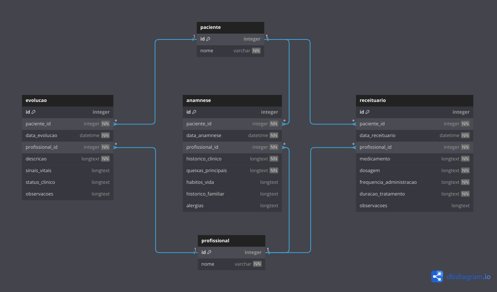

# Integração com PEP (via Banco de Dados)


## DER do banco de dados

Os dados que esta api considerou para construção dos scripts SQL estão descritos no seguinte diagrama de entidade e relacionamento (DER):



A definição do DER acima está descrito no documento [docs/der_dbml.md](der_dbml.md).

## Views do banco de dados

As seguintes views serão consideradas para a criação dos scripts:

```sql
CREATE VIEW view_anamnese AS
SELECT
  a.*, p.nome AS paciente, pr.nome AS profissional
FROM
  anamnese a
JOIN
  paciente p ON a.paciente_id = p.id
JOIN
  profissional pr ON a.profissional_id = pr.id
;

CREATE VIEW view_evolucao AS
SELECT
  e.*, p.nome AS paciente, pr.nome AS profissional
FROM
  evolucao e
JOIN
  paciente p ON e.paciente_id = p.id
JOIN
  profissional pr ON e.profissional_id = pr.id
;

CREATE VIEW view_receituario AS
SELECT
  r.*, p.nome AS paciente, pr.nome AS profissional
FROM
  receituario r
JOIN
  paciente p ON r.paciente_id = p.id
JOIN
  profissional pr ON r.profissional_id = pr.id
;
```

## Ler dados a partir de view no banco de dados

As queries abaixo retornam registros das views com campo id (chave primária) não nulos, e considera como regra de negócio a existência do relacionamento com paciente e com profissional:

```sql
SELECT
  *
FROM
  view_anamnese
WHERE
  id IS NOT NULL -- chave primária não nula
  AND paciente_id IS NOT NULL -- chave estrangeira não nula
  AND profissional_id IS NOT NULL -- chave estrangeira não nula
;

SELECT
  *
FROM
  view_evolucao
WHERE
  id IS NOT NULL -- chave primária não nula
  AND paciente_id IS NOT NULL -- chave estrangeira não nula
  AND profissional_id IS NOT NULL -- chave estrangeira não nula
;

SELECT
  *
FROM
  view_receituario
WHERE
  id IS NOT NULL -- chave primária não nula
  AND paciente_id IS NOT NULL -- chave estrangeira não nula
  AND profissional_id IS NOT NULL -- chave estrangeira não nula
;
```

Como as views foram criadas com a opção JOIN, espera-se que paciente_id e profissional_id sejam não nulos, mas em caso de serem recriadas com a opção LEFT JOIN ou RIGHT JOIN, as condições paciente_id IS NOT NULL e profissional_id IS NOT NULL serão necessárias.

## Garantia de integridade dos dados

As queries seguintes retornam os campos id com a quantidade de repetições maiores de 1, a fim de verificar a existência de dados duplicados:

```sql
SELECT
  id,
  COUNT(*)
FROM
  paciente
GROUP BY
  id
HAVING
  COUNT(*) > 1
;

SELECT
  id,
  COUNT(*)
FROM
  profissional
GROUP BY
  id
HAVING
  COUNT(*) > 1
;

SELECT
  id,
  COUNT(*)
FROM
  view_anamnese
GROUP BY
  id
HAVING
  COUNT(*) > 1
;

SELECT
  id,
  COUNT(*)
FROM
  view_evolucao
GROUP BY
  id
HAVING
  COUNT(*) > 1
;

SELECT
  id,
  COUNT(*)
FROM
  view_receituario
GROUP BY
  id
HAVING
  COUNT(*) > 1
;
```


As queries abaixo retornam o número de linhas com dados ausentes na chave primária:

```sql
SELECT
  count(*)
FROM
  paciente
WHERE
  id IS NULL
;

SELECT
  count(*)
FROM
  profissional
WHERE
  id IS NULL
;

SELECT
  count(*)
FROM
  view_anamnese
WHERE
  id IS NULL
;

SELECT
  count(*)
FROM
  view_evolucao
WHERE
  id IS NULL
;

SELECT
  count(*)
FROM
  view_receituario
WHERE
  id IS NULL
;
```


## Garantias de integridade verificadas

Num ambiente de banco de dados há diversas formas de garantir a integridade para assegurar a consistência dos dados. As principais garantias de integridade que podem ser implementadas em banco de dados são:
- Integridade de entidade
    - Chaves primárias (PRIMARY KEY)
    - Verificação de duplicatas (GROUP BY + HAVING COUNT())
- Integridade de referência
    - Chaves estrangeiras (FOREIGN KEY):
- Integridade de domínio
    - Restrições de domínio (CONSTRAINTS CHECK)
    - Conjuntos predefinidos (ENUM)
- Integridade de atributo
    - Não nulo (NOT NULL)
    - Valor padrão (DEFAULT)
- Integridade de unicidade
    - Chaves únicas (UNIQUE)
- Triggers para Validação e Integridade
    - Gatilhos (TRIGGER)
- Integridade de Consistência de Dados
    - Transações (ACID - Atomicidade, Consistência, Isolamento e Durabilidade)

Idealmente, essas garantias de integridade devem ser implementadas no banco de dados e nas SQL que manipulam suas informações, mas é comum encontrar sistemas no qual as garantias não são adotadas.

Para o teste em questão, considerando o banco de dados e as views utilizadas para contrução dos scripts, foram adotadas as garantias de integridade de entidade, de referência e de atributo não nulo.


## Executar os scripts

Uma base de dados MySQL foi configurada para executar os scripts SQL descritos acima em um container Docker:

```bash
docker compose up db -d
```

O script `docs/init-db.sql` cria as tabelas e as views, e é necessário executar antes do script de leitura:

```bash
docker exec -i db sh -c 'mysql -uroot -p"$MYSQL_ROOT_PASSWORD" db' < docs/init-db.sql
```

O script `docs/script-chave-primaria-nula.sql` faz a verificação de dados ausentes nas chaves primárias, de acordo com a discussão realizada anteriormente neste documento:

```bash
docker exec -i db sh -c 'mysql -uroot -p"$MYSQL_ROOT_PASSWORD" db' < docs/script-chave-primaria-nula.sql
```

Já o script `docs/cript-dados-duplicados.sql` faz a verificação de dados duplicados:

```bash
docker exec -i db sh -c 'mysql -uroot -p"$MYSQL_ROOT_PASSWORD" db' < docs/cript-dados-duplicados.sql
```

---

Volta para [README](../README.md)
